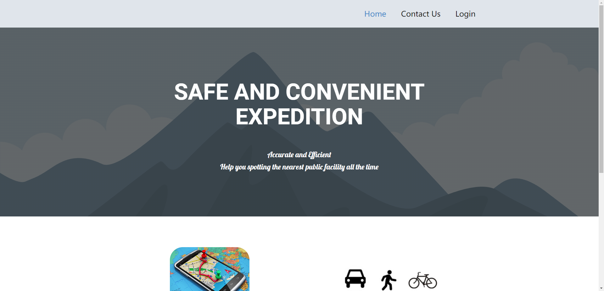
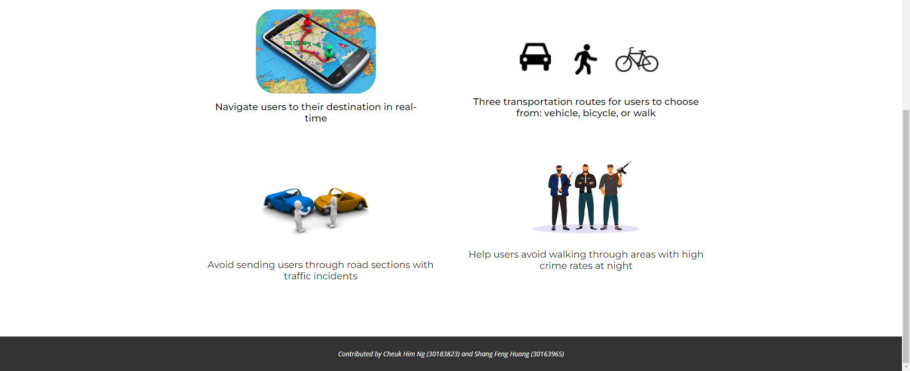
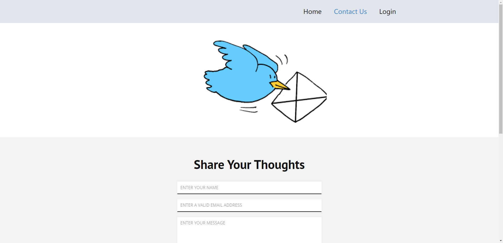
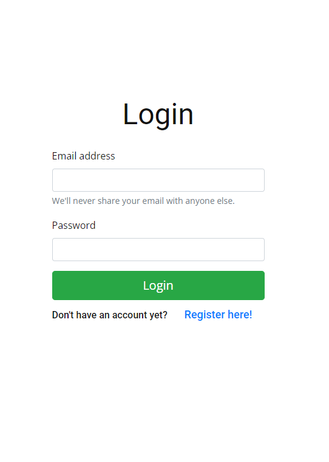
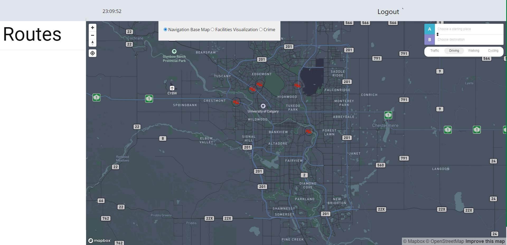
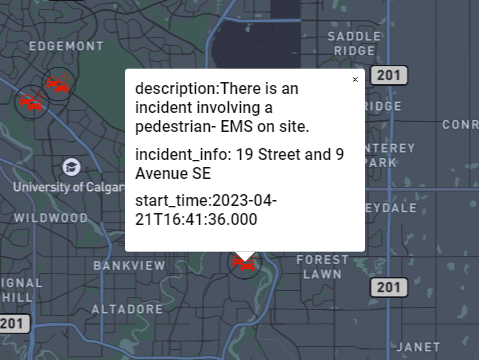
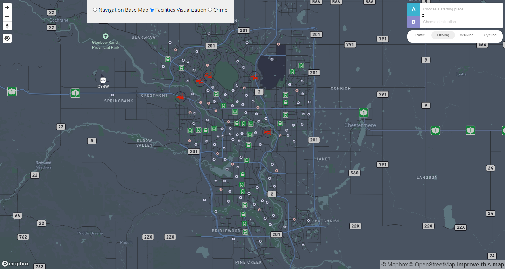
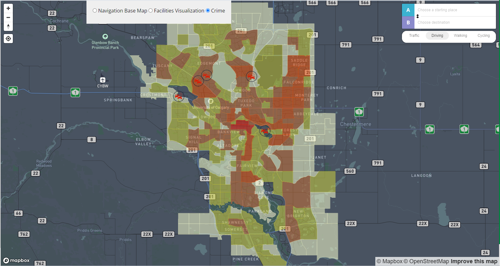
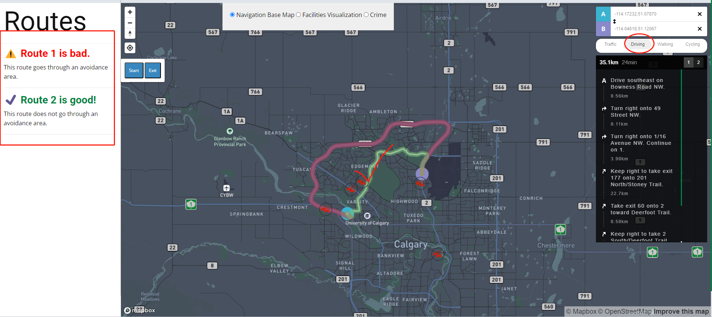

# Safe And Convenient Expedition
[toc]

## 1. File system
```
--static
    |--- css
        |--- Frontend.css           # nvigation page css style
        |--- contactus.css           # contact us page css style
        |--- homepage.css            # home page css style
        |--- nicepage.css            # nice page template css style, it is used in every page
    |--- images                      # including website and readme images
    |--- js
        |--- jquery.js               # default javascript file
        |--- map.js                  # it's used in the frontend page and includs the main functions.
        |--- nicepage.js             # nice page template default js file
--templates
    |--- Contact.html                # contact page
    |--- Frontend.html               # nvigation page
    |--- Homepage.html               # home page
    |--- Login.html                  # login page
    |--- Register.html               # Register page
--appliation.py                      # start python file
--import.py                          # create database table
--index.html                         # github demo page
```

## 2. API
* **Current Traffic Incidents API**
    1. <u>Json url</u>:  https://data.calgary.ca/resource/4jah-h97u.json
    2. <u>Request type</u>: Get
    3. <u>Parameters Used</u>: Latitude (number) and Longitude (number)
    4. <u>Information Display on the Mapping Front End</u>: Description (Text), Incident_Info (Text), Start_time (Date & Time)
* **LRT Stations API**
    1. <u>Json url</u>:  https://data.calgary.ca/resource/2axz-xm4q.json
    2. <u>Request type</u>: Get
    3. <u>Parameters Used</u>: Latitude (number) and Longitude (number)
    4. <u>Information Display on the Mapping Front End</u>：The closest LRT station--name
* **Community Service API**
    1. <u>Json url</u>:  https://data.calgary.ca/resource/x34e-bcjz.json
    2. <u>Request type</u>: Get
    3. <u>Parameters Used</u>: Latitude (number) and Longitude (number), Type (Text) = Attraction
    4. <u>Information Display on the Mapping Front End</u>：The closest attraction--name
   
* **Mapbox Directions API**
   1. <u>Json url</u>:  https://api.mapbox.com/directions/v5/mapbox/{profile}/{coordinates}
   2. <u>Request type</u>: Get
   3. <u>Parameters Used</u>: Profile (String) – Transportation Modes Coordinates (String) – Origin (long1, lat1) and Destination (long2, lat2) Mapbox API access token (String)
   4. <u>Information Display on the Mapping Front End</u>：Control panel showing the starting and ending coordinates and modes of transportation

## 3. Database
```
    * Database tool: Progresql
    * Web server: AWS ubuntu20, Flask
    * Table: users (email, passwd)
             feedback (email, name, text)
```

## 4. Results
* **Homepage.html**
    Homepage introduces our motivation and purpose for developing this website.
    
    
* **Contactus.html**
 

* **login.html and register.html**
  <div style="display: flex; flex-direction: row;">
    
    
    </div>
* **Current Traffic Incidents API used in frontend page**
  <div style="display: flex; flex-direction: row;">
    
    
</div>

* **Facilities Visualization and Crime map**
  The user can choose which layer is displayed.
<div style="display: flex; flex-direction: row;">
    
    
</div>

* **Route function**
Visualization of navigation results on the mapping Front-End after selecting starting and ending points, displaying customized routes specifically tailored for the "Driving" travel method. 


